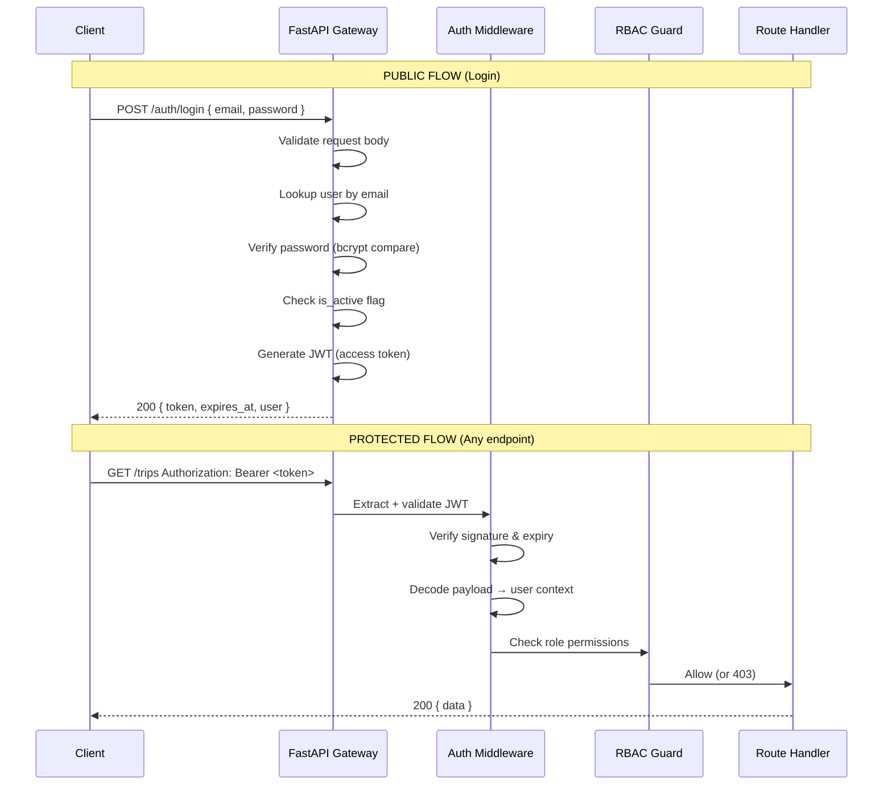
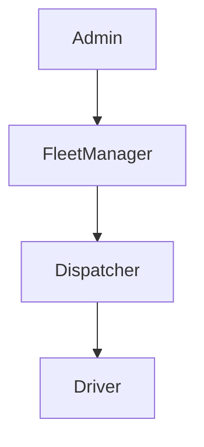
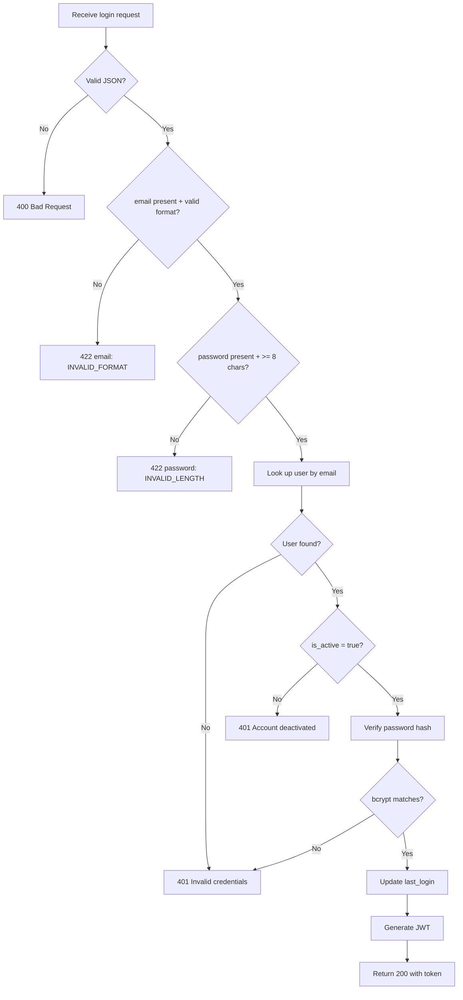
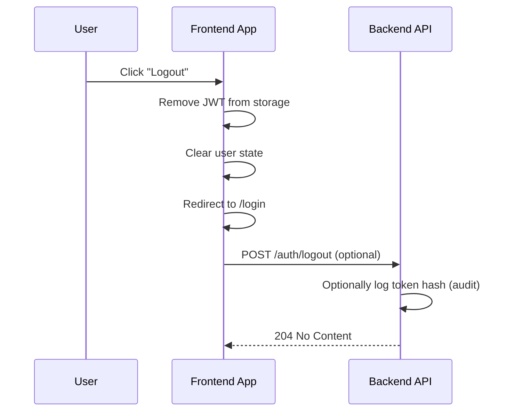
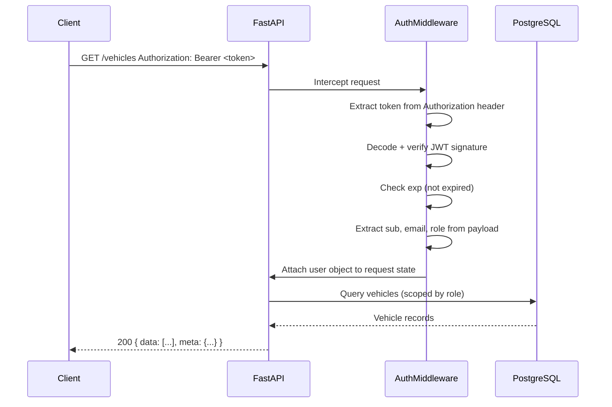
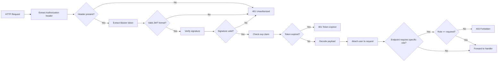
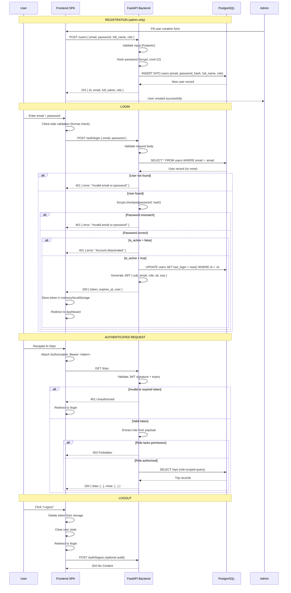

# Authentication — TransitOps

> **Protocol:** JWT Bearer Token
> **Password Hashing:** bcrypt
> **Session Model:** Stateless (no server-side session storage)

---

## Authentication Architecture

TransitOps uses a stateless JWT-based authentication system with Role-Based Access Control (RBAC). There is no server-side session storage — every authenticated request carries its own proof of identity and permissions in the form of a signed JWT.

### Core Components

| Component | Responsibility |
|---|---|
| **Password Hasher** | Converts plain-text passwords into bcrypt hashes for storage |
| **JWT Service** | Signs and verifies JSON Web Tokens |
| **Auth Middleware** | Intercepts requests, validates tokens, extracts user context |
| **RBAC Guard** | Checks the user's role against required permissions for each endpoint |
| **Login Endpoint** | Accepts credentials, verifies password, issues JWT |

### Authentication Flow



### Session Lifecycle

```
[Login] → JWT issued (valid for 24 hours)
              │
              ├── [Within expiry] → Every request re-validates the token
              │                        No server-side state lookup needed
              │
              ├── [Token expires]  → 401 Unauthorized
              │                        Client calls POST /auth/refresh
              │                        New JWT issued (extended session)
              │
              └── [Logout]        → Token discarded client-side
                                     (no server-side invalidation)
```

---

## User Roles

The system defines four hierarchical roles via the `user_role` ENUM in the database.

### Role Hierarchy



Higher roles inherit all permissions of lower roles plus their own.

### Role Descriptions

| Role | DB Value | Typical User | Description |
|---|---|---|---|
| **Admin** | `admin` | System administrator | Full system access, user management, configuration |
| **Fleet Manager** | `fleet_manager` | Operations manager | Manages drivers, vehicles, maintenance, fuel, expenses |
| **Dispatcher** | `dispatcher` | Trip scheduler | Creates and manages trips, views operational data |
| **Driver** | `driver` | Vehicle operator | Views own assignments, records fuel/expenses for active trips |

### Permission Matrix

| Module | Action | admin | fleet_manager | dispatcher | driver |
|---|---|---|---|---|---|
| **Auth** | Login | ✅ | ✅ | ✅ | ✅ |
| **Auth** | Refresh token | ✅ | ✅ | ✅ | ✅ |
| **Auth** | View own profile | ✅ | ✅ | ✅ | ✅ |
| **Users** | List | ✅ | ✅ | ❌ | ❌ |
| **Users** | Create | ✅ | ❌ | ❌ | ❌ |
| **Users** | Update | ✅ | ❌ | ❌ | ❌ |
| **Users** | Deactivate | ✅ | ❌ | ❌ | ❌ |
| **Drivers** | List | ✅ | ✅ | ✅ | ❌ |
| **Drivers** | View | ✅ | ✅ | ✅ | ✅ (own) |
| **Drivers** | Create | ✅ | ✅ | ❌ | ❌ |
| **Drivers** | Update | ✅ | ✅ | ❌ | ❌ |
| **Drivers** | Delete | ✅ | ❌ | ❌ | ❌ |
| **Vehicles** | List | ✅ | ✅ | ✅ | ✅ |
| **Vehicles** | View | ✅ | ✅ | ✅ | ✅ |
| **Vehicles** | Create | ✅ | ✅ | ❌ | ❌ |
| **Vehicles** | Update | ✅ | ✅ | ❌ | ❌ |
| **Vehicles** | Delete | ✅ | ❌ | ❌ | ❌ |
| **Trips** | List | ✅ | ✅ | ✅ | ✅ (own) |
| **Trips** | View | ✅ | ✅ | ✅ | ✅ (own) |
| **Trips** | Create | ✅ | ✅ | ✅ | ❌ |
| **Trips** | Update | ✅ | ✅ | ✅ | ❌ |
| **Trips** | Start | ✅ | ✅ | ✅ | ✅ (own) |
| **Trips** | Complete | ✅ | ✅ | ✅ | ✅ (own) |
| **Trips** | Cancel | ✅ | ✅ | ✅ | ❌ |
| **Maintenance** | Full CRUD | ✅ | ✅ | ❌ | ❌ |
| **Maintenance** | View | ✅ | ✅ | ✅ | ❌ |
| **Fuel Logs** | Full CRUD | ✅ | ✅ | ❌ | ❌ |
| **Fuel Logs** | Create | ✅ | ✅ | ❌ | ✅ |
| **Fuel Logs** | View | ✅ | ✅ | ✅ | ❌ |
| **Expenses** | Full CRUD | ✅ | ✅ | ❌ | ❌ |
| **Expenses** | Create | ✅ | ✅ | ❌ | ✅ |
| **Expenses** | View | ✅ | ✅ | ✅ | ❌ |
| **Notifications** | View own | ✅ | ✅ | ✅ | ✅ |
| **Notifications** | Mark read | ✅ | ✅ | ✅ | ✅ |
| **Notifications** | Delete own | ✅ | ✅ | ✅ | ✅ |
| **Dashboard** | View | ✅ | ✅ | ✅ | ✅ (limited) |

---

## Login Flow

### Request

```
POST /auth/login
Content-Type: application/json

{
    "email": "admin@transitops.com",
    "password": "SecurePass1!"
}
```

### Validation Sequence



### Password Verification

Passwords are stored as bcrypt hashes (never plain text). Verification uses bcrypt's constant-time comparison to prevent timing attacks:

```
1. Retrieve stored hash from users.password_hash
2. Run bcrypt.checkpw(plaintext_password, stored_hash)
3. Return true/false (constant time)
```

### JWT Generation

After successful password verification:

1. Create JWT payload with:
   - `sub`: user UUID
   - `email`: user email
   - `role`: user role
   - `iat`: issued at (current Unix timestamp)
   - `exp`: expiration (current time + 24 hours)
2. Sign payload with `HS256` using the configured `JWT_SECRET_KEY`
3. Base64url-encode and return to client

### Success Response

```
HTTP 200 OK
Content-Type: application/json

{
    "data": {
        "token": "eyJhbGciOiJIUzI1NiIsInR5cCI6IkpXVCJ9...",
        "expires_at": "2026-07-13T10:00:00Z",
        "user": {
            "id": "550e8400-e29b-41d4-a716-446655440000",
            "email": "admin@transitops.com",
            "full_name": "Admin User",
            "role": "admin",
            "is_active": true
        }
    }
}
```

### Error Responses

| Condition | HTTP Code | Error Code | Message |
|---|---|---|---|
| Invalid JSON body | 400 | `BAD_REQUEST` | Request body must be valid JSON |
| Missing email | 422 | `VALIDATION_ERROR` | email is required |
| Invalid email format | 422 | `VALIDATION_ERROR` | email must be a valid email address |
| Missing password | 422 | `VALIDATION_ERROR` | password is required |
| Short password | 422 | `VALIDATION_ERROR` | password must be at least 8 characters |
| User not found | 401 | `UNAUTHORIZED` | Invalid email or password |
| Incorrect password | 401 | `UNAUTHORIZED` | Invalid email or password |
| Account deactivated | 401 | `UNAUTHORIZED` | Account has been deactivated |

**Note:** The 401 responses for "user not found" and "incorrect password" use identical messages to prevent email enumeration attacks.

---

## Logout Flow

TransitOps uses stateless JWTs — there is no server-side session to invalidate. Logout is handled entirely on the client side.

### Client-Side Logout



### What Client Must Do

1. Remove the JWT from localStorage/sessionStorage
2. Clear any cached user state in the application store
3. Redirect to the login page
4. (Optional) Notify the server for audit logging

### Token Expiry vs. Logout

| Scenario | Behavior |
|---|---|
| User clicks Logout | Token removed client-side; API calls stop immediately |
| Token expires naturally (24h) | Next API call returns 401; client redirects to login |
| Token is compromised | No server-side revocation available in stateless model; requires waiting for expiry or changing `JWT_SECRET_KEY` |

**Future Enhancement:** A token blacklist (stored in Redis) could be added for immediate revocation of compromised tokens.

---

## Protected Route Flow



### What Happens When Validation Fails

| Failure Mode | HTTP Code | Client Action |
|---|---|---|
| No `Authorization` header | 401 | Show login page |
| Malformed token | 401 | Clear token, redirect to login |
| Invalid signature | 401 | Clear token, redirect to login |
| Token expired | 401 | Call POST /auth/refresh, retry original request |
| Token expired + refresh fails | 401 | Clear token, redirect to login |
| Role insufficient for endpoint | 403 | Show "access denied" page |

---

## Password Security

### Hashing Algorithm

| Property | Value |
|---|---|
| **Algorithm** | bcrypt |
| **Work Factor** | 12 (configurable) |
| **Salt** | Auto-generated per password (22 characters) |
| **Output** | 60-character string (`$2b$12$...`) |
| **Library** | `passlib[bcrypt]` or `bcrypt` |

### Storage

```
users.password_hash = "$2b$12$LJ3m4ys3Lk1H8s9dG7HsqO5d8Fh2Ks9Xn1M3Vb4Nc5R6T7v8B9wC"
```

The hash includes the algorithm identifier, work factor, salt, and the hash itself. No plain-text password is ever stored or logged.

### Password Validation Rules

| Rule | Reason |
|---|---|
| Minimum 8 characters | Prevent brute-force of short passwords |
| At least 1 uppercase letter | Increase entropy |
| At least 1 lowercase letter | Increase entropy |
| At least 1 digit | Increase entropy |
| At least 1 special character | Increase entropy |
| Maximum 128 characters | Prevent DoS on bcrypt hashing |
| Not a common password | Reject against known password list (optional) |

### What Not To Do

- Never store passwords in plain text
- Never log passwords (in request bodies, error messages, or debug output)
- Never return password hashes in API responses
- Never use unsalted hashes (MD5, SHA-1, SHA-256 without salt)
- Never use reversible encryption for passwords
- Never truncate or modify the password before hashing

---

## Token Structure

### JWT Payload

```json
{
    "sub": "550e8400-e29b-41d4-a716-446655440000",
    "email": "admin@transitops.com",
    "role": "admin",
    "iat": 1720764000,
    "exp": 1720850400
}
```

### Payload Fields

| Field | Type | Description |
|---|---|---|
| `sub` | string (UUID) | Subject — the user's unique identifier |
| `email` | string | User's email address (for display/audit) |
| `role` | string | User's role from `user_role` ENUM |
| `iat` | integer (Unix) | Issued at — when the token was created |
| `exp` | integer (Unix) | Expiration — when the token becomes invalid |

### Token Size

Approximately 350-400 bytes as a compact JWT string.

---

## Authentication Middleware

### Middleware Pipeline



### Middleware Components

| Component | Input | Output | Responsibility |
|---|---|---|---|
| **Token Extractor** | Raw request | Token string or None | Reads `Authorization: Bearer <token>` header |
| **JWT Validator** | Token string | Decoded payload or Error | Verifies signature, checks expiry, decodes claims |
| **User Resolver** | Decoded payload | User object (optional) | Fetches user from DB to verify they still exist and are active |
| **Role Checker** | User object + required role | Boolean | Compares user role against endpoint's required role |

### Public vs. Protected Routes

| Route Type | Auth Required | Example |
|---|---|---|
| **Public** | No | `POST /auth/login`, `GET /health` |
| **Protected** | Yes + valid token | All other endpoints |
| **Role-Restricted** | Yes + specific role | `POST /users` (admin only) |

---

## Security Best Practices

### HTTP-Only Cookies

The JWT is delivered in the JSON response body for flexibility (mobile apps, SPAs). If using cookie transport:

```
Set-Cookie: access_token=<jwt>; HttpOnly; Secure; SameSite=Strict; Path=/; Max-Age=86400
```

| Directive | Value | Purpose |
|---|---|---|
| `HttpOnly` | Enabled | Prevents JavaScript access (XSS protection) |
| `Secure` | Enabled | Only sent over HTTPS |
| `SameSite` | `Strict` | Prevents CSRF attacks |
| `Path` | `/` | Available to all endpoints |
| `Max-Age` | `86400` | 24 hours in seconds |

### CORS Configuration

```json
{
    "allow_origins": ["http://localhost:5173"],
    "allow_methods": ["GET", "POST", "PATCH", "DELETE"],
    "allow_headers": ["Content-Type", "Authorization"],
    "allow_credentials": true,
    "expose_headers": ["X-Total-Count", "X-Total-Pages"]
}
```

In production, `allow_origins` must be locked to the actual frontend domain(s).

### Input Validation

| Layer | Tool | Scope |
|---|---|---|
| **API Gateway** | Pydantic schemas | Request body structure and field types |
| **Service Layer** | Custom validators | Business rules (overlap checks, state transitions) |
| **Database** | CHECK constraints, FK constraints | Data integrity at rest |

### SQL Injection Prevention

- All database queries use parameterized statements via SQLAlchemy ORM
- Raw SQL queries are never constructed via string concatenation
- User input is never interpolated directly into SQL strings

### Rate Limiting

| Endpoint Group | Limit | Window | Applied To |
|---|---|---|---|
| `/auth/login` | 5 attempts | 15 minutes | Per IP address |
| `/auth/refresh` | 10 attempts | 15 minutes | Per user |
| All other endpoints | 1000 requests | 15 minutes | Per authenticated user |

Rate limit headers returned in every response:

```
X-RateLimit-Limit: 1000
X-RateLimit-Remaining: 997
X-RateLimit-Reset: 1720764900
```

### CSRF Considerations

Since the API uses JWT in the `Authorization` header (not cookies for the primary transport), it is not vulnerable to traditional CSRF attacks. However:

- If cookie-based JWT transport is added, CSRF tokens must be implemented
- The `SameSite=Strict` cookie attribute provides CSRF protection for cookie-based auth
- Idempotent operations (GET, PUT, DELETE) are inherently CSRF-safe by design

### Additional Measures

| Measure | Implementation |
|---|---|
| **HTTPS only** | All production traffic over TLS |
| **Short token expiry** | 24 hours (configurable) |
| **No sensitive data in JWT** | Payload contains only sub, email, role |
| **Audit logging** | All auth failures logged with timestamp and IP |
| **Account lockout** | (future) Lock after N consecutive failed login attempts |
| **2FA** | (future) Optional TOTP-based two-factor authentication |
| **Token refresh rotation** | Each refresh invalidates previous token |

---

## Sequence Diagram

### Full Authentication Flow



---

## Authentication Checklist

### API Implementation

- [ ] `POST /auth/login` accepts email + password, returns JWT
- [ ] `POST /auth/refresh` accepts valid token, returns new token
- [ ] `POST /auth/logout` returns 204 (optional audit)
- [ ] `GET /auth/me` returns current user profile
- [ ] All protected endpoints return 401 without valid token
- [ ] All role-restricted endpoints return 403 for unauthorized roles
- [ ] Login returns identical 401 message for wrong email vs. wrong password
- [ ] Deactivated users receive 401 on login attempt
- [ ] Token expiry is honoured (expired tokens return 401)

### Frontend Implementation

- [ ] Login form validates email format and password length before submission
- [ ] Login form shows error messages from API (not generic)
- [ ] Token stored securely (memory preferred; httpOnly cookie if available)
- [ ] Auth interceptor attaches `Authorization: Bearer <token>` to every request
- [ ] Auth interceptor catches 401 responses and redirects to login
- [ ] Token refresh is attempted automatically on 401 before redirecting
- [ ] Logout clears token and redirects to login
- [ ] UI components conditionally render based on user role
- [ ] Navigation hides inaccessible routes based on role

### Security

- [ ] Passwords hashed with bcrypt (cost factor ≥ 12)
- [ ] Plain-text passwords never stored or logged
- [ ] Password hashes never returned in API responses
- [ ] All passwords validated against rules (min length, character classes)
- [ ] JWT secret key is strong (≥ 256 bits) and stored in environment variable
- [ ] JWT signed with HS256
- [ ] Rate limiting applied to `/auth/login` (5 attempts / 15 min per IP)
- [ ] CORS configured with specific origins (not `*` in production)
- [ ] Database queries use parameterized statements (no SQL injection)
- [ ] Pydantic validation on all request bodies
- [ ] SQLAlchemy ORM used for all queries (no raw SQL)
- [ ] HTTPS enforced in production

### Testing

- [ ] Unit tests for password hashing and verification
- [ ] Unit tests for JWT generation, validation, and expiry
- [ ] Integration tests for login success and failure scenarios
- [ ] Integration test for token refresh
- [ ] Integration test for protected routes (401 without token)
- [ ] Integration test for RBAC (403 for wrong role)
- [ ] Integration test for deactivated user login
- [ ] Integration test for rate limiting
- [ ] No hardcoded secrets in tests

### Documentation

- [ ] Authentication flow documented for frontend team
- [ ] JWT payload structure documented
- [ ] Role-permission matrix documented
- [ ] Token refresh flow documented
- [ ] Error scenarios documented
- [ ] Security considerations documented
