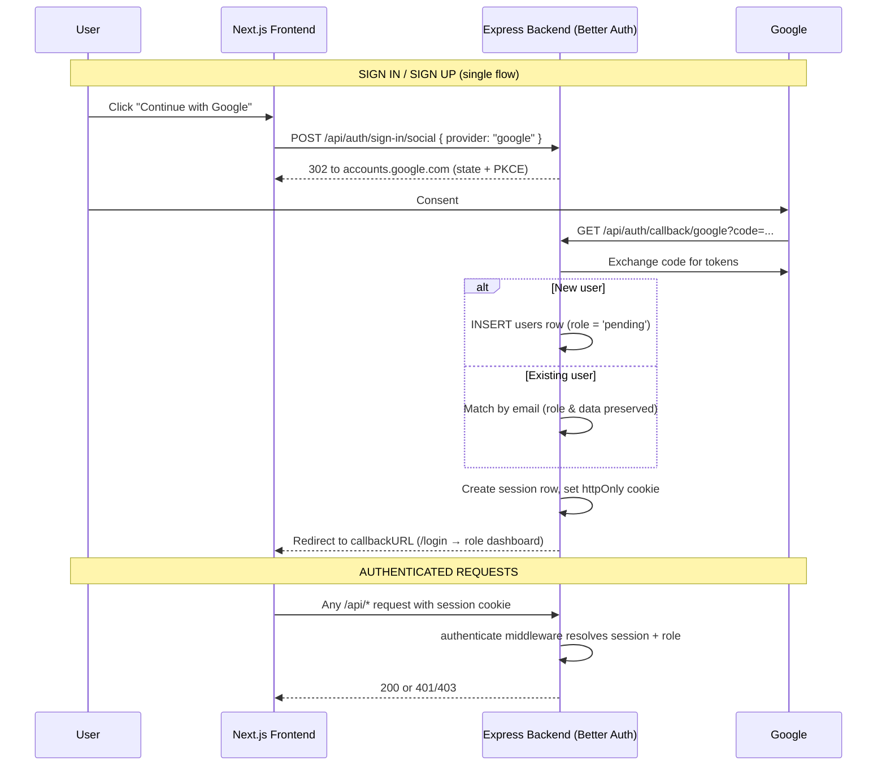

# Authentication — TransitOps

> **Protocol:** Google OAuth 2.0 (the only sign-in/sign-up method)
> **Auth & Sessions:** [Better Auth](https://www.better-auth.com/) running inside the Express backend
> **Session Model:** Server-side sessions in PostgreSQL (`sessions` table), httpOnly signed cookies

---

## Authentication Architecture

TransitOps uses **Google OAuth exclusively** for both sign-in and sign-up. Better Auth manages
the full identity lifecycle (user creation/linking, session issuance, revocation). There are no
passwords anywhere in the system — no password storage, reset, or email verification flows.

### Core Components

| Component | Location | Responsibility |
|---|---|---|
| **Better Auth instance** | `backend/src/modules/auth/better-auth.ts` | Google provider config, user/session/account models mapped onto the TransitOps `users` table |
| **Better Auth HTTP handler** | `backend/src/index.ts` (`app.all("/api/auth/*")`) | Serves `/api/auth/sign-in/social`, `/api/auth/callback/google`, `/api/auth/get-session`, `/api/auth/sign-out`, … |
| **Profile endpoint** | `backend/src/modules/auth/auth.routes.ts` | `GET /api/auth/me` — richer TransitOps profile (adds `driver_id` for drivers) |
| **Session middleware** | `backend/src/modules/auth/auth.middleware.ts` | `authenticate` validates the Better Auth session and attaches `req.user = { userId, role, email }` |
| **RBAC guards** | `backend/src/modules/auth/auth.middleware.ts` | `authorize(...roles)` and `authorizeModule(name)` — unchanged role-based authorization |
| **Frontend client** | `frontend/src/lib/auth-client.ts` | `better-auth/react` client (`signIn.social`, `signOut`) |
| **Route protection** | `frontend/src/proxy.ts` | Verifies every page navigation against a live backend session; role-gates routes |

### Environment Variables (backend only)

| Variable | Purpose |
|---|---|
| `DATABASE_URL` | PostgreSQL connection used by Express and Better Auth |
| `BETTER_AUTH_SECRET` | HMAC secret for signing session cookies |
| `BETTER_AUTH_URL` | Public base URL of the backend (OAuth redirect target) |
| `FRONTEND_URL` | Frontend origin (CORS + trusted OAuth origin) |
| `GOOGLE_CLIENT_ID` / `GOOGLE_CLIENT_SECRET` | Google Cloud OAuth client (Web application) |

Secrets live exclusively in backend environment configuration. Nothing auth-related is exposed
to the frontend via `NEXT_PUBLIC_*`.

**Google Cloud redirect URI:** `{BETTER_AUTH_URL}/api/auth/callback/google`

---

## Authentication Flow


```mermaid
sequenceDiagram
    participant User
    participant Client as Next.js Frontend
    participant API as Express Backend (Better Auth)
    participant Google

    Note over User,Google: SIGN IN / SIGN UP (single flow)
    User->>Client: Click "Continue with Google"
    Client->>API: POST /api/auth/sign-in/social { provider: "google" }
    API-->>Client: 302 to accounts.google.com (state + PKCE)
    User->>Google: Consent
    Google->>API: GET /api/auth/callback/google?code=...
    API->>Google: Exchange code for tokens
    alt New user
        API->>API: INSERT users row (role = 'pending')
    else Existing user
        API->>API: Match by email (role & data preserved)
    end
    API->>API: Create session row, set httpOnly cookie
    API-->>Client: Redirect to callbackURL (/login → role dashboard)

    Note over User,Google: AUTHENTICATED REQUESTS
    Client->>API: Any /api/* request with session cookie
    API->>API: authenticate middleware resolves session + role
    API-->>Client: 200 or 401/403
```

### First-Time Users (Safe Onboarding)

New Google users are created automatically with the safe `pending` role:

* `GET /api/auth/me` succeeds (identity resolves).
* Every module API returns `403 "Your account is awaiting role assignment"`.
* The UI holds them on `/pending` with a Sign Out button until an admin assigns a real role:

```sql
UPDATE users SET role = 'driver' WHERE email = 'someone@gmail.com';
```

Existing users matched by email keep their current role and all foreign-key relationships.

---

## Session Lifecycle

```
[Google sign-in] → session row created (default 7 days)
        │
        ├── [Every request]  → cookie verified server-side (signed, httpOnly)
        │
        ├── [Refresh]        → session persists; frontend re-resolves via GET /api/auth/me
        │
        └── [Logout]         → POST /api/auth/sign-out deletes the session row
                               and clears all auth cookies
```

There are no JWTs and no custom tokens. The browser holds only an opaque,
HMAC-signed, httpOnly session cookie that maps to a database session.

---

## Protected Routes

| Layer | Mechanism |
|---|---|
| Backend APIs | `authenticate` middleware → 401 without a valid session; `authorize` / `authorizeModule` → 403 on insufficient role |
| Frontend pages | `proxy.ts` verifies each navigation server-to-server (`GET /api/auth/me` with forwarded cookies); unauthenticated → `/login`, wrong role → allowed pages only |

Failure modes:

| Failure | Result |
|---|---|
| No/expired/invalid session cookie | 401 from APIs; redirect to `/login` from pages |
| Role missing module permission | 403 |
| Role = `pending` | Held on `/pending`; module APIs return 403 |
| Deactivated user (`is_active = false`) | Treated as unauthenticated (401) |

---

## Logout Flow

1. User clicks **Sign Out** (`Navbar`, or the button on `/pending`).
2. Frontend calls `authClient.signOut()` → `POST /api/auth/sign-out`.
3. Better Auth deletes the session row and clears `better-auth.session_token`
   (+ state/cache cookies) via `Set-Cookie: Max-Age=0`.
4. Client state resets and the user lands back on the login/landing page.
5. Subsequent protected requests fail with 401 — server-side revocation is immediate.

---

## User Roles

The system defines hierarchical roles via the `user_role` ENUM:
`admin`, `fleet_manager`, `dispatcher`, `driver` (plus the onboarding-only `pending`).

### Permission Matrix

Module-level permissions come from `admin_settings.role_permissions` (JSONB) with admin bypass;
page-level allowlists mirror this in `frontend/src/proxy.ts` and `frontend/src/utils/resolve-dashboard-route.ts`.

| Module | admin | fleet_manager | dispatcher | driver |
|---|---|---|---|---|
| Auth (Google sign-in, own profile) | ✅ | ✅ | ✅ | ✅ |
| Users list | ✅ | ✅ | ❌ | ❌ |
| Drivers CRUD | ✅ | ✅ | view only | ❌ |
| Vehicles CRUD | ✅ | ✅ | view only | view only |
| Trips manage | ✅ | ✅ | ✅ | own only |
| Maintenance CRUD | ✅ | ✅ | ❌ | ❌ |
| Fuel Logs create/view | ✅ | ✅ | ❌ | ✅ (own) |
| Expenses create/approve | ✅ | ✅ | ❌ | ✅ (own, no approval) |
| Reports | ✅ | ✅ | ❌ | ❌ |
| Notifications | ✅ | ✅ | ✅ | ✅ (own) |
| Admin settings | ✅ | ❌ | ❌ | ❌ |

---

## Security Notes

- **No passwords exist in the system.** No hashing, validation, reset, or verification code paths remain.
- Session cookies: `httpOnly`, `SameSite=Lax`, `Secure` in production, HMAC-signed with `BETTER_AUTH_SECRET`.
- CSRF: Better Auth enforces Origin checks against `trustedOrigins` (`FRONTEND_URL`) on non-GET endpoints.
- CORS: backend allows only `FRONTEND_URL` with credentials enabled.
- Revocation: logout deletes the DB session — immediate and server-side.
- Google account deprovisioning: sessions can be revoked by deleting rows from `sessions`.
