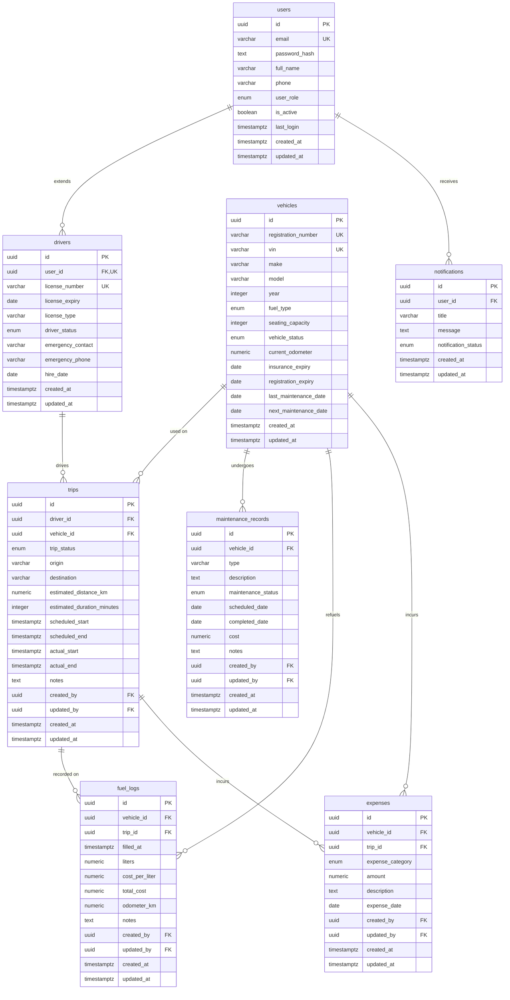

# Database Schema — TransitOps

> **Documentation generated from:** `database/schema.sql`
> **Last updated:** July 2026

---

## Project Overview

TransitOps is a Fleet & Transport Management System designed for the Odoo Hackathon 2026. It manages the complete lifecycle of transport operations including driver assignment, vehicle tracking, trip scheduling, maintenance planning, fuel consumption logging, expense tracking, and in-app notifications.

---

## Database Overview

| Attribute | Value |
|---|---|
| **Database Engine** | PostgreSQL 16 |
| **Extension** | `pgcrypto` — provides `gen_random_uuid()` |
| **Primary Key Strategy** | UUID v4 across all tables |
| **Normalization** | Third Normal Form (3NF) |
| **Total Tables** | 8 |
| **Total ENUM Types** | 8 |
| **Total Constraints** | 40 (5 UNIQUE, 17 CHECK, 18 FOREIGN KEY) |
| **Total Indexes** | 23 (4 partial) |
| **Audit Columns** | `created_at`, `updated_at` on every table; `created_by`, `updated_by` on transactional tables |

---

## Complete Entity List

| # | Table | Purpose | Type |
|---|---|---|---|
| 1 | `users` | System-wide user accounts (admin, fleet managers, dispatchers, drivers) | Reference |
| 2 | `drivers` | Driver-specific profile extending the user account | Transactional |
| 3 | `vehicles` | Fleet vehicle registry with technical specs and compliance dates | Reference |
| 4 | `trips` | Scheduled and completed trips linking drivers to vehicles | Transactional |
| 5 | `maintenance_records` | Vehicle maintenance scheduling and completion history | Transactional |
| 6 | `fuel_logs` | Fuel refueling events with cost and odometer tracking | Transactional |
| 7 | `expenses` | Operational expenses linked to vehicles and optionally to trips | Transactional |
| 8 | `notifications` | In-app notification messages targeting specific users | Transactional |

---

## Entity Relationship Diagram



---

## Table Documentation

### `users`

**Purpose:** Stores system-wide user accounts. Every person who interacts with the system has an entry here. The `role` column determines access permissions. `password_hash` stores a bcrypt hash (variable length, hence `TEXT`).

**Columns:**

| Column | Type | Constraints | Description |
|---|---|---|---|
| `id` | `UUID` | `PK DEFAULT gen_random_uuid()` | Primary key |
| `email` | `VARCHAR(255)` | `NOT NULL UNIQUE` | User email address (login identifier) |
| `password_hash` | `TEXT` | `NOT NULL` | Bcrypt password hash |
| `full_name` | `VARCHAR(255)` | `NOT NULL` | Display name |
| `phone` | `VARCHAR(50)` | — | Contact number; validated via regex CHECK |
| `role` | `user_role` | `NOT NULL` | System role (admin, fleet_manager, dispatcher, driver) |
| `is_active` | `BOOLEAN` | `NOT NULL DEFAULT true` | Account disabled flag |
| `last_login` | `TIMESTAMPTZ` | — | Timestamp of most recent successful login |
| `created_at` | `TIMESTAMPTZ` | `NOT NULL DEFAULT now()` | Row creation timestamp |
| `updated_at` | `TIMESTAMPTZ` | `NOT NULL DEFAULT now()` | Row last-update timestamp |

**Primary Key:** `id`

**Constraints:**

| Name | Type | Definition |
|---|---|---|
| `uq_users_email` | UNIQUE | `(email)` |
| `ck_users_phone` | CHECK | `phone IS NULL OR phone ~ '^\+?[0-9\s\-\(\)]{7,20}$'` |

**Indexes:**

| Name | Columns | Type |
|---|---|---|
| `idx_users_role` | `(role)` | B-tree |

---

### `drivers`

**Purpose:** Extends `users` with driver-specific information. Maintains a 1:1 relationship with users — each driver is a user, but not every user is a driver.

**Columns:**

| Column | Type | Constraints | Description |
|---|---|---|---|
| `id` | `UUID` | `PK DEFAULT gen_random_uuid()` | Primary key |
| `user_id` | `UUID` | `NOT NULL UNIQUE FK → users(id) CASCADE` | Reference to the user account |
| `license_number` | `VARCHAR(100)` | `NOT NULL UNIQUE` | Government-issued driving license number |
| `license_expiry` | `DATE` | `NOT NULL` | Date the driving license expires |
| `license_type` | `VARCHAR(50)` | — | Class or category of license (e.g., "CDL A", "Standard") |
| `status` | `driver_status` | `NOT NULL DEFAULT 'available'` | Current operational status |
| `emergency_contact` | `VARCHAR(255)` | — | Emergency contact person name |
| `emergency_phone` | `VARCHAR(50)` | — | Emergency contact phone; validated via regex |
| `hire_date` | `DATE` | `NOT NULL` | Date of hiring; must not be in the future |
| `created_at` | `TIMESTAMPTZ` | `NOT NULL DEFAULT now()` | Row creation timestamp |
| `updated_at` | `TIMESTAMPTZ` | `NOT NULL DEFAULT now()` | Row last-update timestamp |

**Primary Key:** `id`

**Foreign Keys:**

| Name | From | To | On Delete | On Update |
|---|---|---|---|---|
| `fk_drivers_user` | `drivers(user_id)` | `users(id)` | CASCADE | CASCADE |

**Constraints:**

| Name | Type | Definition |
|---|---|---|
| `uq_drivers_user_id` | UNIQUE | `(user_id)` |
| `uq_drivers_license_number` | UNIQUE | `(license_number)` |
| `ck_drivers_license_expiry` | CHECK | `license_expiry > '1900-01-01'` |
| `ck_drivers_hire_date` | CHECK | `hire_date <= CURRENT_DATE` |
| `ck_drivers_emergency_phone` | CHECK | `emergency_phone IS NULL OR phone regex pattern` |

**Indexes:**

| Name | Columns | Type |
|---|---|---|
| `idx_drivers_status` | `(status)` | B-tree |

---

### `vehicles`

**Purpose:** Fleet vehicle registry. Tracks technical specifications, compliance dates, odometer readings, and operational status.

**Columns:**

| Column | Type | Constraints | Description |
|---|---|---|---|
| `id` | `UUID` | `PK DEFAULT gen_random_uuid()` | Primary key |
| `registration_number` | `VARCHAR(50)` | `NOT NULL UNIQUE` | License plate or registration identifier |
| `vin` | `VARCHAR(50)` | `UNIQUE` | Vehicle Identification Number (nullable for legacy vehicles) |
| `make` | `VARCHAR(100)` | `NOT NULL` | Manufacturer (e.g., Toyota, Volvo) |
| `model` | `VARCHAR(100)` | `NOT NULL` | Model name |
| `year` | `INTEGER` | `NOT NULL` | Manufacturing year; 2000 ≤ year ≤ current + 1 |
| `fuel_type` | `fuel_type` | `NOT NULL` | Fuel type (petrol, diesel, CNG, electric) |
| `seating_capacity` | `INTEGER` | `NOT NULL` | Maximum passenger capacity; must be > 0 |
| `status` | `vehicle_status` | `NOT NULL DEFAULT 'available'` | Current operational status |
| `current_odometer` | `NUMERIC(10,2)` | `NOT NULL DEFAULT 0` | Current odometer reading in km; must be ≥ 0 |
| `insurance_expiry` | `DATE` | — | Date when insurance coverage expires |
| `registration_expiry` | `DATE` | — | Date when vehicle registration expires |
| `last_maintenance_date` | `DATE` | — | Date of most recent maintenance |
| `next_maintenance_date` | `DATE` | — | Planned next maintenance date |
| `created_at` | `TIMESTAMPTZ` | `NOT NULL DEFAULT now()` | Row creation timestamp |
| `updated_at` | `TIMESTAMPTZ` | `NOT NULL DEFAULT now()` | Row last-update timestamp |

**Primary Key:** `id`

**Constraints:**

| Name | Type | Definition |
|---|---|---|
| `uq_vehicles_registration_number` | UNIQUE | `(registration_number)` |
| `uq_vehicles_vin` | UNIQUE | `(vin)` |
| `ck_vehicles_year` | CHECK | `year >= 2000 AND year <= EXTRACT(YEAR FROM CURRENT_DATE) + 1` |
| `ck_vehicles_seating_capacity` | CHECK | `seating_capacity > 0` |
| `ck_vehicles_current_odometer` | CHECK | `current_odometer >= 0` |

**Indexes:**

| Name | Columns | Type | Filter |
|---|---|---|---|
| `idx_vehicles_status` | `(status)` | B-tree | — |
| `idx_vehicles_fuel_type` | `(fuel_type)` | B-tree | — |
| `idx_vehicles_next_maintenance` | `(next_maintenance_date)` | B-tree | `WHERE status != 'inactive'` |

---

### `trips`

**Purpose:** Core operational entity linking a driver to a vehicle for a journey from origin to destination. Tracks scheduling and actual execution with audit trail.

**Columns:**

| Column | Type | Constraints | Description |
|---|---|---|---|
| `id` | `UUID` | `PK DEFAULT gen_random_uuid()` | Primary key |
| `driver_id` | `UUID` | `NOT NULL FK → drivers(id) RESTRICT` | Assigned driver |
| `vehicle_id` | `UUID` | `NOT NULL FK → vehicles(id) RESTRICT` | Assigned vehicle |
| `status` | `trip_status` | `NOT NULL DEFAULT 'scheduled'` | Trip lifecycle status |
| `origin` | `VARCHAR(255)` | `NOT NULL` | Starting location name/address |
| `destination` | `VARCHAR(255)` | `NOT NULL` | Ending location name/address |
| `estimated_distance_km` | `NUMERIC(10,2)` | — | Estimated distance for planning; ≥ 0 when provided |
| `estimated_duration_minutes` | `INTEGER` | — | Estimated duration in minutes; ≥ 0 when provided |
| `scheduled_start` | `TIMESTAMPTZ` | `NOT NULL` | Planned departure date/time |
| `scheduled_end` | `TIMESTAMPTZ` | `NOT NULL` | Planned arrival date/time; must be after start |
| `actual_start` | `TIMESTAMPTZ` | — | Actual departure timestamp |
| `actual_end` | `TIMESTAMPTZ` | — | Actual arrival timestamp; ≥ actual_start |
| `notes` | `TEXT` | — | Free-text trip notes |
| `created_by` | `UUID` | `FK → users(id) SET NULL` | User who created the trip |
| `updated_by` | `UUID` | `FK → users(id) SET NULL` | User who last modified the trip |
| `created_at` | `TIMESTAMPTZ` | `NOT NULL DEFAULT now()` | Row creation timestamp |
| `updated_at` | `TIMESTAMPTZ` | `NOT NULL DEFAULT now()` | Row last-update timestamp |

**Primary Key:** `id`

**Foreign Keys:**

| Name | From | To | On Delete | On Update |
|---|---|---|---|---|
| `fk_trips_driver` | `trips(driver_id)` | `drivers(id)` | RESTRICT | CASCADE |
| `fk_trips_vehicle` | `trips(vehicle_id)` | `vehicles(id)` | RESTRICT | CASCADE |
| `fk_trips_created_by` | `trips(created_by)` | `users(id)` | SET NULL | CASCADE |
| `fk_trips_updated_by` | `trips(updated_by)` | `users(id)` | SET NULL | CASCADE |

**Constraints:**

| Name | Type | Definition |
|---|---|---|
| `ck_trips_scheduled_end` | CHECK | `scheduled_end > scheduled_start` |
| `ck_trips_estimated_distance` | CHECK | `estimated_distance_km IS NULL OR estimated_distance_km >= 0` |
| `ck_trips_estimated_duration` | CHECK | `estimated_duration_minutes IS NULL OR estimated_duration_minutes >= 0` |
| `ck_trips_actual_times` | CHECK | `(actual_start IS NULL AND actual_end IS NULL) OR (actual_start IS NOT NULL AND actual_end IS NULL) OR (actual_start IS NOT NULL AND actual_end IS NOT NULL AND actual_end >= actual_start)` |

**Indexes:**

| Name | Columns | Type | Filter |
|---|---|---|---|
| `idx_trips_driver_id` | `(driver_id)` | B-tree | — |
| `idx_trips_vehicle_id` | `(vehicle_id)` | B-tree | — |
| `idx_trips_status` | `(status)` | B-tree | — |
| `idx_trips_scheduled_start` | `(scheduled_start)` | B-tree | — |
| `idx_trips_driver_schedule` | `(driver_id, scheduled_start)` | B-tree | `WHERE status IN ('scheduled', 'in_progress')` |

---

### `maintenance_records`

**Purpose:** Tracks vehicle maintenance events from scheduling through completion. Provides cost tracking and history for fleet maintenance planning.

**Columns:**

| Column | Type | Constraints | Description |
|---|---|---|---|
| `id` | `UUID` | `PK DEFAULT gen_random_uuid()` | Primary key |
| `vehicle_id` | `UUID` | `NOT NULL FK → vehicles(id) CASCADE` | Vehicle being maintained |
| `type` | `VARCHAR(100)` | `NOT NULL` | Maintenance type (e.g., "Oil Change", "Tire Rotation") |
| `description` | `TEXT` | — | Detailed description of work performed |
| `status` | `maintenance_status` | `NOT NULL DEFAULT 'scheduled'` | Maintenance lifecycle status |
| `scheduled_date` | `DATE` | `NOT NULL` | Planned maintenance date |
| `completed_date` | `DATE` | — | Actual completion date; must be ≥ scheduled_date |
| `cost` | `NUMERIC(12,2)` | — | Total cost of maintenance; must be ≥ 0 when provided |
| `notes` | `TEXT` | — | Internal notes |
| `created_by` | `UUID` | `FK → users(id) SET NULL` | User who created the record |
| `updated_by` | `UUID` | `FK → users(id) SET NULL` | User who last modified the record |
| `created_at` | `TIMESTAMPTZ` | `NOT NULL DEFAULT now()` | Row creation timestamp |
| `updated_at` | `TIMESTAMPTZ` | `NOT NULL DEFAULT now()` | Row last-update timestamp |

**Primary Key:** `id`

**Foreign Keys:**

| Name | From | To | On Delete | On Update |
|---|---|---|---|---|
| `fk_maintenance_vehicle` | `maintenance_records(vehicle_id)` | `vehicles(id)` | CASCADE | CASCADE |
| `fk_maintenance_created_by` | `maintenance_records(created_by)` | `users(id)` | SET NULL | CASCADE |
| `fk_maintenance_updated_by` | `maintenance_records(updated_by)` | `users(id)` | SET NULL | CASCADE |

**Constraints:**

| Name | Type | Definition |
|---|---|---|
| `ck_maintenance_cost` | CHECK | `cost IS NULL OR cost >= 0` |
| `ck_maintenance_completed_date` | CHECK | `completed_date IS NULL OR completed_date >= scheduled_date` |

**Indexes:**

| Name | Columns | Type | Filter |
|---|---|---|---|
| `idx_maintenance_vehicle_id` | `(vehicle_id)` | B-tree | — |
| `idx_maintenance_status` | `(status)` | B-tree | — |
| `idx_maintenance_scheduled_date` | `(scheduled_date)` | B-tree | — |
| `idx_maintenance_upcoming` | `(vehicle_id, scheduled_date)` | B-tree | `WHERE status IN ('scheduled', 'in_progress')` |

---

### `fuel_logs`

**Purpose:** Records every refueling event per vehicle. Tracks volume, cost, odometer reading, and optionally links to a specific trip.

**Columns:**

| Column | Type | Constraints | Description |
|---|---|---|---|
| `id` | `UUID` | `PK DEFAULT gen_random_uuid()` | Primary key |
| `vehicle_id` | `UUID` | `NOT NULL FK → vehicles(id) CASCADE` | Vehicle that was refueled |
| `trip_id` | `UUID` | `FK → trips(id) SET NULL` | Trip during which refueling occurred (optional) |
| `filled_at` | `TIMESTAMPTZ` | `NOT NULL DEFAULT now()` | Date/time of refueling |
| `liters` | `NUMERIC(10,2)` | `NOT NULL` | Volume of fuel in liters; must be > 0 |
| `cost_per_liter` | `NUMERIC(8,2)` | `NOT NULL` | Price per liter; must be ≥ 0 |
| `total_cost` | `NUMERIC(12,2)` | `NOT NULL` | Total transaction cost; must be ≥ 0 |
| `odometer_km` | `NUMERIC(10,2)` | `NOT NULL` | Odometer reading at time of refuel; must be ≥ 0 |
| `notes` | `TEXT` | — | Free-text notes |
| `created_by` | `UUID` | `FK → users(id) SET NULL` | User who recorded the refueling |
| `updated_by` | `UUID` | `FK → users(id) SET NULL` | User who last modified the record |
| `created_at` | `TIMESTAMPTZ` | `NOT NULL DEFAULT now()` | Row creation timestamp |
| `updated_at` | `TIMESTAMPTZ` | `NOT NULL DEFAULT now()` | Row last-update timestamp |

**Primary Key:** `id`

**Foreign Keys:**

| Name | From | To | On Delete | On Update |
|---|---|---|---|---|
| `fk_fuel_logs_vehicle` | `fuel_logs(vehicle_id)` | `vehicles(id)` | CASCADE | CASCADE |
| `fk_fuel_logs_trip` | `fuel_logs(trip_id)` | `trips(id)` | SET NULL | CASCADE |
| `fk_fuel_logs_created_by` | `fuel_logs(created_by)` | `users(id)` | SET NULL | CASCADE |
| `fk_fuel_logs_updated_by` | `fuel_logs(updated_by)` | `users(id)` | SET NULL | CASCADE |

**Constraints:**

| Name | Type | Definition |
|---|---|---|
| `ck_fuel_logs_liters` | CHECK | `liters > 0` |
| `ck_fuel_logs_cost_per_liter` | CHECK | `cost_per_liter >= 0` |
| `ck_fuel_logs_total_cost` | CHECK | `total_cost >= 0` |
| `ck_fuel_logs_odometer` | CHECK | `odometer_km >= 0` |

**Indexes:**

| Name | Columns | Type |
|---|---|---|
| `idx_fuel_logs_vehicle_id` | `(vehicle_id)` | B-tree |
| `idx_fuel_logs_trip_id` | `(trip_id)` | B-tree |
| `idx_fuel_logs_filled_at` | `(filled_at)` | B-tree |

---

### `expenses`

**Purpose:** Records operational expenses. Every expense is linked to a vehicle and optionally to a specific trip. Categorized by the `expense_category` ENUM.

**Columns:**

| Column | Type | Constraints | Description |
|---|---|---|---|
| `id` | `UUID` | `PK DEFAULT gen_random_uuid()` | Primary key |
| `vehicle_id` | `UUID` | `NOT NULL FK → vehicles(id) CASCADE` | Vehicle that incurred the expense |
| `trip_id` | `UUID` | `FK → trips(id) SET NULL` | Trip during which expense occurred (optional) |
| `category` | `expense_category` | `NOT NULL` | Expense category (fuel, maintenance, toll, parking, repair, other) |
| `amount` | `NUMERIC(12,2)` | `NOT NULL` | Expense amount; must be ≥ 0 |
| `description` | `TEXT` | — | Free-text description |
| `expense_date` | `DATE` | `NOT NULL` | Date the expense was incurred |
| `created_by` | `UUID` | `FK → users(id) SET NULL` | User who recorded the expense |
| `updated_by` | `UUID` | `FK → users(id) SET NULL` | User who last modified the record |
| `created_at` | `TIMESTAMPTZ` | `NOT NULL DEFAULT now()` | Row creation timestamp |
| `updated_at` | `TIMESTAMPTZ` | `NOT NULL DEFAULT now()` | Row last-update timestamp |

**Primary Key:** `id`

**Foreign Keys:**

| Name | From | To | On Delete | On Update |
|---|---|---|---|---|
| `fk_expenses_vehicle` | `expenses(vehicle_id)` | `vehicles(id)` | CASCADE | CASCADE |
| `fk_expenses_trip` | `expenses(trip_id)` | `trips(id)` | SET NULL | CASCADE |
| `fk_expenses_created_by` | `expenses(created_by)` | `users(id)` | SET NULL | CASCADE |
| `fk_expenses_updated_by` | `expenses(updated_by)` | `users(id)` | SET NULL | CASCADE |

**Constraints:**

| Name | Type | Definition |
|---|---|---|
| `ck_expenses_amount` | CHECK | `amount >= 0` |

**Indexes:**

| Name | Columns | Type |
|---|---|---|
| `idx_expenses_vehicle_id` | `(vehicle_id)` | B-tree |
| `idx_expenses_trip_id` | `(trip_id)` | B-tree |
| `idx_expenses_expense_date` | `(expense_date)` | B-tree |

---

### `notifications`

**Purpose:** Stores in-app notifications targeted at specific users. Supports read/unread tracking for UI badge counts.

**Columns:**

| Column | Type | Constraints | Description |
|---|---|---|---|
| `id` | `UUID` | `PK DEFAULT gen_random_uuid()` | Primary key |
| `user_id` | `UUID` | `NOT NULL FK → users(id) CASCADE` | Recipient user |
| `title` | `VARCHAR(255)` | `NOT NULL` | Short notification title |
| `message` | `TEXT` | `NOT NULL` | Full notification message body |
| `status` | `notification_status` | `NOT NULL DEFAULT 'unread'` | Read status (unread, read) |
| `created_at` | `TIMESTAMPTZ` | `NOT NULL DEFAULT now()` | Row creation timestamp |
| `updated_at` | `TIMESTAMPTZ` | `NOT NULL DEFAULT now()` | Row last-update timestamp |

**Primary Key:** `id`

**Foreign Keys:**

| Name | From | To | On Delete | On Update |
|---|---|---|---|---|
| `fk_notifications_user` | `notifications(user_id)` | `users(id)` | CASCADE | CASCADE |

**Indexes:**

| Name | Columns | Type | Filter |
|---|---|---|---|
| `idx_notifications_user_id` | `(user_id)` | B-tree | — |
| `idx_notifications_status` | `(status)` | B-tree | — |
| `idx_notifications_user_unread` | `(user_id, created_at DESC)` | B-tree | `WHERE status = 'unread'` |

---

## ENUM Types

The schema defines 8 PostgreSQL ENUM types that enforce domain values at the database level:

| ENUM Name | Values | Used In |
|---|---|---|
| `user_role` | `admin`, `fleet_manager`, `dispatcher`, `driver` | `users.role` |
| `driver_status` | `available`, `on_trip`, `on_leave`, `inactive` | `drivers.status` |
| `vehicle_status` | `available`, `assigned`, `maintenance`, `inactive` | `vehicles.status` |
| `trip_status` | `scheduled`, `in_progress`, `completed`, `cancelled` | `trips.status` |
| `maintenance_status` | `scheduled`, `in_progress`, `completed` | `maintenance_records.status` |
| `fuel_type` | `petrol`, `diesel`, `cng`, `electric` | `vehicles.fuel_type` |
| `notification_status` | `unread`, `read` | `notifications.status` |
| `expense_category` | `fuel`, `maintenance`, `toll`, `parking`, `repair`, `other` | `expenses.category` |

---

## Relationship Summary

| Relationship | Type | From | To | Via |
|---|---|---|---|---|
| User has Driver profile | 1:1 | `users` | `drivers` | `drivers.user_id` |
| Driver operates Trips | 1:N | `drivers` | `trips` | `trips.driver_id` |
| Vehicle is used on Trips | 1:N | `vehicles` | `trips` | `trips.vehicle_id` |
| Vehicle undergoes Maintenance | 1:N | `vehicles` | `maintenance_records` | `maintenance_records.vehicle_id` |
| Vehicle records Fuel Logs | 1:N | `vehicles` | `fuel_logs` | `fuel_logs.vehicle_id` |
| Vehicle incurs Expenses | 1:N | `vehicles` | `expenses` | `expenses.vehicle_id` |
| Trip records Fuel Logs | 1:N | `trips` | `fuel_logs` | `fuel_logs.trip_id` (nullable) |
| Trip incurs Expenses | 1:N | `trips` | `expenses` | `expenses.trip_id` (nullable) |
| User receives Notifications | 1:N | `users` | `notifications` | `notifications.user_id` |
| User creates/updates records | 1:N | `users` | trips, maintenance, fuel_logs, expenses | `created_by` / `updated_by` |

---

## Database Creation Order

Tables must be created in dependency order to satisfy foreign key constraints:

```
1. users              (no dependencies)
2. drivers            (depends on: users)
3. vehicles           (no dependencies)
4. trips              (depends on: drivers, vehicles)
5. maintenance_records (depends on: vehicles)
6. fuel_logs          (depends on: vehicles, trips)
7. expenses           (depends on: vehicles, trips)
8. notifications      (depends on: users)
```

ENUMs must be created before any table that references them. The execution order within `schema.sql` already respects these constraints.

---

## Future Scalability Notes

- **Sharding:** The use of UUID primary keys makes horizontal sharding straightforward since UUIDs are globally unique across partitions.
- **Partitioning:** `trips`, `fuel_logs`, and `expenses` are strong candidates for partitioning by date range (e.g., monthly or quarterly) as the fleet scales.
- **Caching:** Frequently accessed reference data (active drivers, available vehicles) should be cached at the application layer. Partial indexes on status columns support efficient queries for active entities.
- **Archival:** Consider a soft-delete strategy or a cold-storage archive for completed trips older than a configurable threshold.
- **Notification cleanup:** Implement a TTL-based cleanup job to delete read notifications older than N days.
- **Full-text search:** Adding a `tsvector` column on `trips.notes`, `maintenance_records.description`, and `expenses.description` would enable full-text search capabilities.
- **GIS extension:** For future geolocation features (route tracking, geofencing), the `postgis` extension can be added and columns like `origin`/`destination` replaced with `GEOMETRY` types.
